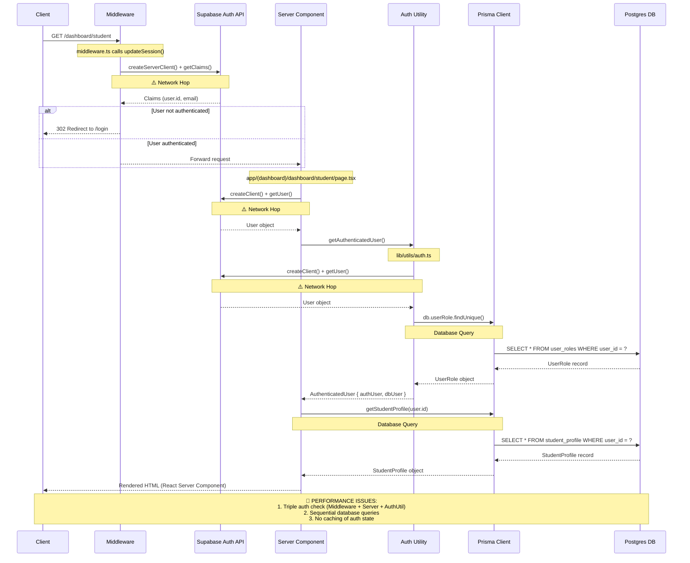
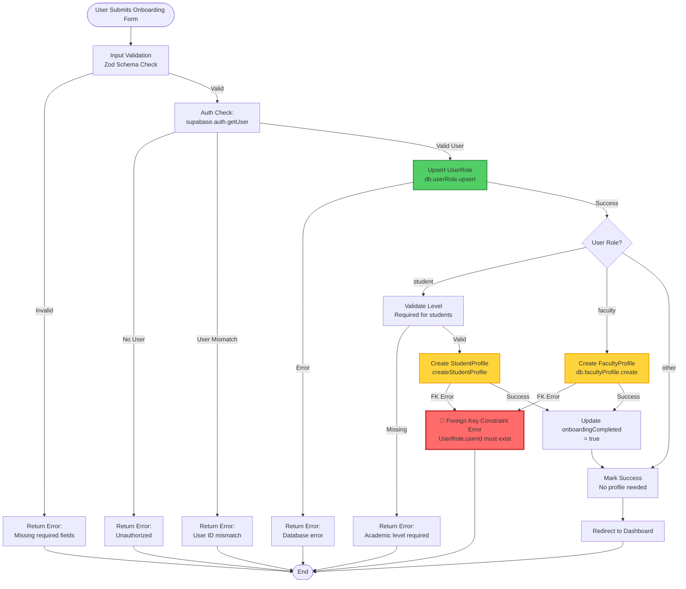

# Architecture Visualization & Performance Audit

## Diagram 1: Request Lifecycle (Sequence Diagram)

This diagram traces a request to a protected route (e.g., `/dashboard/student`) showing all network hops and potential latency points.



## Diagram 2: Data Schema (ER Diagram)

This diagram visualizes the relationship between `UserRole` and `StudentProfile`, highlighting potential integrity issues.

```mermaid
erDiagram
    UserRole ||--o| StudentProfile : "has (1:0..1)"
    UserRole ||--o| FacultyProfile : "has (1:0..1)"
    StudentProfile }o--|| StudentGroup : "belongs to (N:1)"
    StudentProfile ||--o{ StudentEnrollment : "has (1:N)"
    
    UserRole {
        uuid userId PK
        enum role
        string name
        string email
        boolean onboardingCompleted
        datetime createdAt
        datetime updatedAt
    }
    
    StudentProfile {
        uuid userId PK_FK
        int level
        uuid studentGroupId FK
        string department
        datetime createdAt
        datetime updatedAt
    }
    
    FacultyProfile {
        uuid userId PK_FK
        json preferredTimes
        json unavailableTimes
        int maxLoadPerWeek
        datetime createdAt
        datetime updatedAt
    }
    
    StudentGroup {
        uuid id PK
        int level
        int size
        string name
    }
    
    StudentEnrollment {
        uuid id PK
        uuid studentId FK
        uuid sectionId FK
        enum status
        string enrollmentType
    }
    
    Note1 ||--|| UserRole : "CASCADE DELETE"
    Note1 {
        string "onDelete: Cascade<br/>✅ Prevents orphaned profiles"
    }
    
    Note2 ||--|| StudentProfile : "FOREIGN KEY"
    Note2 {
        string "userId references UserRole.userId<br/>⚠️ Must exist before creating profile"
    }
```

**Key Relationships:**
- **UserRole → StudentProfile**: 1:0..1 (One user can have zero or one student profile)
- **UserRole → FacultyProfile**: 1:0..1 (One user can have zero or one faculty profile)
- **Cascade Delete**: ✅ Configured correctly - deleting UserRole automatically deletes related profiles
- **Foreign Key Constraint**: ⚠️ StudentProfile.userId must reference existing UserRole.userId

## Diagram 3: Write Operation Flowchart (Onboarding)

This diagram visualizes the `completeOnboarding` Server Action, showing where foreign key constraint errors can occur.



**Critical Path Analysis:**
1. ✅ **Upsert UserRole First**: Prevents FK constraint errors
2. ⚠️ **Race Condition Risk**: If two requests create profile simultaneously
3. 🔴 **Error Point**: If UserRole upsert fails silently, profile creation will fail

---

## Performance Audit

### 1. Network Hops Analysis

**Current State:**
- **Middleware**: 1 call to Supabase Auth (`getClaims()`)
- **Server Component**: 1 call to Supabase Auth (`getUser()`)
- **Auth Utility**: 1 call to Supabase Auth (`getUser()`)
- **Total**: **3 Supabase Auth API calls per protected route request**

**Impact:**
- Each auth call adds ~50-150ms latency (depending on network)
- Total auth overhead: **150-450ms per request**
- Cold start penalty: First request may take longer due to connection establishment

**Recommendations:**
1. **Cache auth state in middleware**: Pass user object via headers/cookies to server components
2. **Single auth check**: Use middleware result, don't re-authenticate in server components
3. **Use Next.js `cookies()` API**: Share auth state between middleware and server components

### 2. Waterfall Analysis (Sequential vs Parallel)

**Current Pattern (Sequential):**
```typescript
// app/(dashboard)/dashboard/student/page.tsx
const user = await supabase.auth.getUser()           // Wait 50ms
const authUser = await getAuthenticatedUser()        // Wait 100ms (auth + DB)
const studentProfile = await getStudentProfile()     // Wait 30ms
// Total: ~180ms sequential
```

**Optimized Pattern (Parallel):**
```typescript
// Could be parallelized:
const [user, studentProfile] = await Promise.all([
  getAuthenticatedUser(),      // Fetches both auth + userRole
  getStudentProfile(user.id)   // Independent query
])
// Total: ~100ms (max of both)
```

**Waterfall Issues Found:**
1. ❌ **Auth checks are sequential**: Middleware → Server Component → Auth Utility
2. ❌ **Database queries are sequential**: UserRole → StudentProfile (could be parallel with `include`)
3. ✅ **Prisma Client is singleton**: Correctly implemented in `lib/db.ts`

**Recommendations:**
1. **Use Prisma `include`**: Fetch related data in single query
   ```typescript
   const user = await db.userRole.findUnique({
     where: { userId },
     include: { studentProfile: true }
   })
   ```
2. **Parallelize independent queries**: Use `Promise.all()` for unrelated data
3. **Batch middleware checks**: Combine auth + onboarding status in single middleware pass

### 3. Connection Management Analysis

**Prisma Client Implementation:**
```typescript
// lib/db.ts - CORRECT ✅
const globalForPrisma = globalThis as unknown as {
  prisma?: PrismaClient
}

export const db: PrismaClient = globalForPrisma.prisma || new PrismaClient({
  adapter,
  log: process.env.NODE_ENV === 'development' ? ['query', 'error', 'warn'] : ['error'],
})

globalForPrisma.prisma = db
```

**Connection Pool Configuration:**
```typescript
// PostgreSQL Pool Settings
const pool = new Pool({
  connectionString: databaseUrl,
  connectionTimeoutMillis: 10000,
  idleTimeoutMillis: 30000,
  max: 10,  // ⚠️ May be too low for production
})
```

**Issues Identified:**
1. ✅ **Singleton Pattern**: Correctly prevents connection exhaustion
2. ⚠️ **Pool Size**: `max: 10` may be insufficient for high-traffic routes
3. ✅ **Error Handling**: Proper connection error handling with helpful messages
4. ⚠️ **No Connection Pooling Metrics**: Missing monitoring for pool exhaustion

**Recommendations:**
1. **Increase pool size for production**: `max: 20-50` depending on traffic
2. **Add connection pool monitoring**: Log pool stats (active, idle, waiting)
3. **Implement connection retry logic**: For transient connection failures
4. **Use Prisma Accelerate** (if available): For connection pooling and query caching

---

## Summary of Critical Issues

### 🔴 High Priority
1. **Triple Auth Check**: 3 Supabase API calls per request (150-450ms overhead)
2. **Sequential Database Queries**: UserRole → StudentProfile could be single query with `include`
3. **No Auth State Caching**: Middleware result not shared with server components

### 🟡 Medium Priority
1. **Connection Pool Size**: May need increase for production traffic
2. **Missing Parallelization**: Independent queries not batched
3. **Race Condition Risk**: Onboarding flow not atomic (could use transactions)

### 🟢 Low Priority
1. **Add Connection Pool Metrics**: Monitor for exhaustion
2. **Implement Query Result Caching**: For frequently accessed data
3. **Add Request Tracing**: Track latency across middleware → server → DB

---

## Quick Wins (Immediate Improvements)

1. **Eliminate duplicate auth checks**: Use middleware result in server components
2. **Use Prisma `include`**: Fetch UserRole + StudentProfile in single query
3. **Increase connection pool**: `max: 20` for development, `max: 50` for production
4. **Add request context**: Pass user object from middleware to avoid re-fetching

