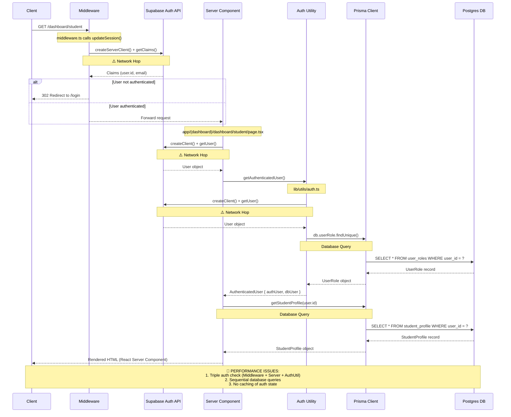

```mermaid
sequenceDiagram
    participant Client
    participant Middleware
    participant SupabaseAuth as Supabase Auth API
    participant ServerComponent as Server Component
    participant AuthUtil as Auth Utility
    participant PrismaClient as Prisma Client
    participant PostgresDB as Postgres DB

    Client->>Middleware: GET /dashboard/student
    Note over Middleware: middleware.ts calls updateSession()
    
    Middleware->>SupabaseAuth: createServerClient() + getClaims()
    Note over Middleware,SupabaseAuth: ⚠️ Network Hop #1<br/>Validates JWT token
    SupabaseAuth-->>Middleware: Claims (user.id, email)
    
    alt User not authenticated
        Middleware-->>Client: 302 Redirect to /login
    else User authenticated
        Middleware-->>ServerComponent: Forward request
    end
    
    Note over ServerComponent: app/(dashboard)/dashboard/student/page.tsx
    
    ServerComponent->>SupabaseAuth: createClient() + getUser()
    Note over ServerComponent,SupabaseAuth: ⚠️ Network Hop #2<br/>DUPLICATE AUTH CHECK
    SupabaseAuth-->>ServerComponent: User object
    
    ServerComponent->>AuthUtil: getAuthenticatedUser()
    Note over AuthUtil: lib/utils/auth.ts
    
    AuthUtil->>SupabaseAuth: createClient() + getUser()
    Note over AuthUtil,SupabaseAuth: ⚠️ Network Hop #3<br/>TRIPLE AUTH CHECK
    SupabaseAuth-->>AuthUtil: User object
    
    AuthUtil->>PrismaClient: db.userRole.findUnique()
    Note over AuthUtil,PrismaClient: Database Query #1<br/>Fetch user role
    PrismaClient->>PostgresDB: SELECT * FROM user_roles WHERE user_id = ?
    PostgresDB-->>PrismaClient: UserRole record
    PrismaClient-->>AuthUtil: UserRole object
    AuthUtil-->>ServerComponent: AuthenticatedUser { authUser, dbUser }
    
    ServerComponent->>PrismaClient: getStudentProfile(user.id)
    Note over ServerComponent,PrismaClient: Database Query #2<br/>Fetch student profile
    PrismaClient->>PostgresDB: SELECT * FROM student_profile WHERE user_id = ?
    PostgresDB-->>PrismaClient: StudentProfile record
    PrismaClient-->>ServerComponent: StudentProfile object
    
    ServerComponent-->>Client: Rendered HTML (React Server Component)
    
    Note over Client,PostgresDB: 🔴 PERFORMANCE ISSUES:<br/>1. Triple auth check (Middleware + Server + AuthUtil)<br/>2. Sequential database queries<br/>3. No caching of auth state
```
