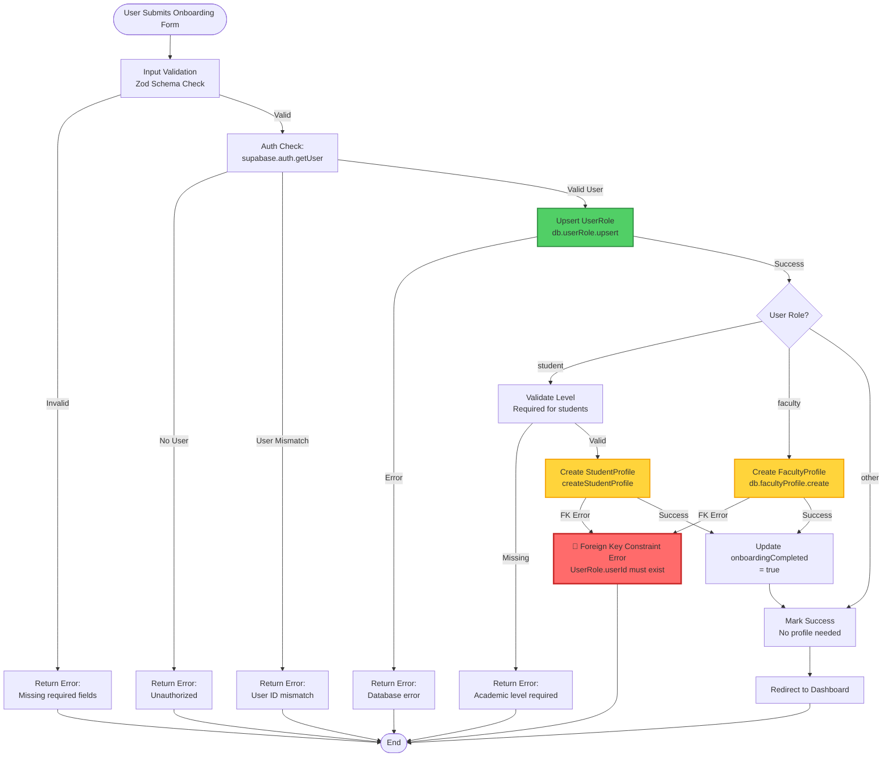

```mermaid
flowchart TD
    Start([User Submits Onboarding Form]) --> Validate[Input Validation<br/>Zod Schema Check]
    
    Validate -->|Invalid| Error1[Return Error:<br/>Missing required fields]
    Validate -->|Valid| AuthCheck[Auth Check:<br/>supabase.auth.getUser]
    
    AuthCheck -->|No User| Error2[Return Error:<br/>Unauthorized]
    AuthCheck -->|User Mismatch| Error3[Return Error:<br/>User ID mismatch]
    AuthCheck -->|Valid User| UpsertUserRole[Upsert UserRole<br/>db.userRole.upsert]
    
    UpsertUserRole -->|Error| Error4[Return Error:<br/>Database error]
    UpsertUserRole -->|Success| CheckRole{User Role?}
    
    CheckRole -->|student| ValidateLevel[Validate Level<br/>Required for students]
    CheckRole -->|faculty| CreateFaculty[Create FacultyProfile<br/>db.facultyProfile.create]
    CheckRole -->|other| Success[Mark Success<br/>No profile needed]
    
    ValidateLevel -->|Missing| Error5[Return Error:<br/>Academic level required]
    ValidateLevel -->|Valid| CreateStudent[Create StudentProfile<br/>createStudentProfile]
    
    CreateStudent -->|FK Error| Error6[🔴 Foreign Key Constraint Error<br/>UserRole.userId must exist]
    CreateStudent -->|Success| UpdateOnboarding[Update onboardingCompleted<br/>= true]
    
    CreateFaculty -->|FK Error| Error6
    CreateFaculty -->|Success| UpdateOnboarding
    
    UpdateOnboarding --> Success
    Success --> Redirect[Redirect to Dashboard]
    
    Error1 --> End([End])
    Error2 --> End
    Error3 --> End
    Error4 --> End
    Error5 --> End
    Error6 --> End
    Redirect --> End
    
    style Error6 fill:#ff6b6b,stroke:#c92a2a,stroke-width:3px
    style UpsertUserRole fill:#51cf66,stroke:#2b8a3e,stroke-width:2px
    style CreateStudent fill:#ffd43b,stroke:#f59f00,stroke-width:2px
    style CreateFaculty fill:#ffd43b,stroke:#f59f00,stroke-width:2px
```
