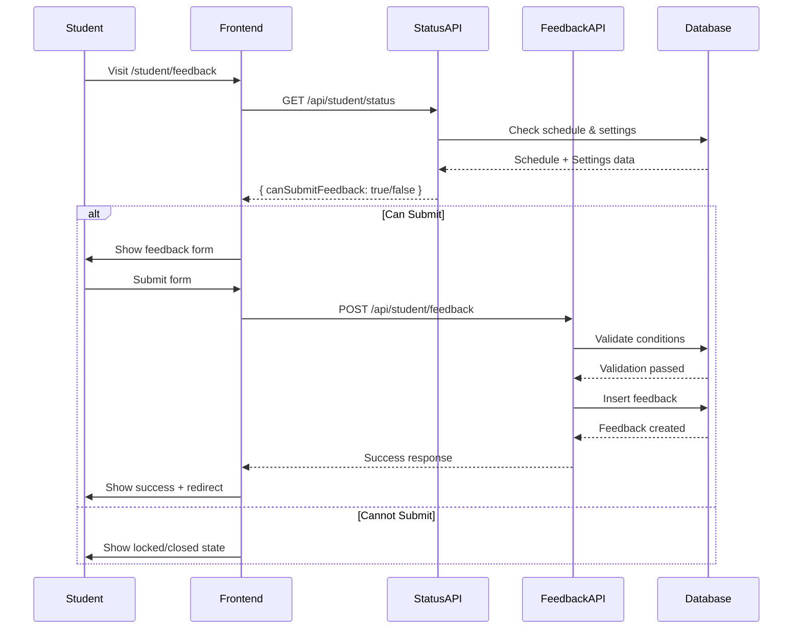

# Student Status & Feedback API Reference

## Overview
APIs for managing student status checking and feedback submission with proper gating logic.

---

## Student Status API

### GET `/api/student/status`

Check if a student has a schedule and if feedback is available.

#### Authentication
Required - Student role

#### Request
```http
GET /api/student/status
Authorization: Bearer <token>
```

#### Response
```json
{
  "success": true,
  "data": {
    "hasSchedule": true,
    "scheduleId": "uuid",
    "feedbackOpen": true,
    "schedulePublished": true,
    "canSubmitFeedback": true,
    "hasSubmittedPreferences": true,
    "hasSubmittedFeedback": false,
    "activeTerm": "Fall 2024"
  }
}
```

#### Response Fields

| Field | Type | Description |
|-------|------|-------------|
| `hasSchedule` | boolean | Whether student has an assigned schedule |
| `scheduleId` | string \| null | UUID of the student's current schedule |
| `feedbackOpen` | boolean | Whether feedback period is open |
| `schedulePublished` | boolean | Whether schedules are published |
| `canSubmitFeedback` | boolean | Combined check: hasSchedule && feedbackOpen && !hasSubmittedFeedback |
| `hasSubmittedPreferences` | boolean | Whether student submitted elective preferences |
| `hasSubmittedFeedback` | boolean | Whether student already submitted feedback for current schedule |
| `activeTerm` | string \| null | Name of the active academic term |

#### Error Responses

```json
// 401 Unauthorized
{
  "success": false,
  "error": "Unauthorized"
}

// 500 Server Error
{
  "success": false,
  "error": "Failed to fetch student status"
}
```

#### Usage Example

```typescript
const response = await fetch('/api/student/status');
const data = await response.json();

if (data.success && data.data.canSubmitFeedback) {
  // Show feedback form
} else {
  // Show locked/closed state
}
```

---

## Feedback Submission API

### POST `/api/student/feedback`

Submit feedback for a student's schedule.

#### Authentication
Required - Student role

#### Validation Rules
1. Student must have an assigned schedule
2. Feedback period must be open
3. Student cannot submit duplicate feedback for the same schedule

#### Request
```http
POST /api/student/feedback
Authorization: Bearer <token>
Content-Type: application/json

{
  "feedbackText": "The schedule works well for me...",
  "rating": 4,
  "scheduleId": "optional-uuid"
}
```

#### Request Body

| Field | Type | Required | Validation |
|-------|------|----------|------------|
| `feedbackText` | string | Yes | Min 10 characters |
| `rating` | number | Yes | Integer 1-5 |
| `scheduleId` | string | No | UUID format |

#### Response - Success

```json
{
  "success": true,
  "data": {
    "feedback": {
      "id": "uuid",
      "student_id": "uuid",
      "schedule_id": "uuid",
      "feedback_text": "The schedule works well for me...",
      "rating": 4,
      "created_at": "2025-01-26T10:00:00Z",
      "updated_at": "2025-01-26T10:00:00Z"
    }
  }
}
```

#### Error Responses

```json
// 400 Bad Request - Validation Error
{
  "success": false,
  "error": "Validation error",
  "details": [
    {
      "path": ["feedbackText"],
      "message": "Feedback must be at least 10 characters"
    }
  ]
}

// 403 Forbidden - No Schedule
{
  "success": false,
  "error": "Cannot submit feedback without an assigned schedule"
}

// 403 Forbidden - Feedback Closed
{
  "success": false,
  "error": "Feedback submission is currently closed"
}

// 409 Conflict - Already Submitted
{
  "success": false,
  "error": "You have already submitted feedback for this schedule"
}
```

#### Usage Example

```typescript
const submitFeedback = async (feedbackText: string, rating: number) => {
  try {
    const response = await fetch('/api/student/feedback', {
      method: 'POST',
      headers: {
        'Content-Type': 'application/json',
      },
      body: JSON.stringify({
        feedbackText,
        rating,
      }),
    });

    const data = await response.json();

    if (data.success) {
      // Show success message
      return { success: true };
    } else {
      // Show error message
      return { success: false, error: data.error };
    }
  } catch (error) {
    return { success: false, error: 'Network error' };
  }
};
```

---

## Scheduler Feedback Settings API

### GET `/api/committee/scheduler/feedback-settings`

Get current feedback period settings.

#### Authentication
Required - Scheduling Committee role

#### Request
```http
GET /api/committee/scheduler/feedback-settings
Authorization: Bearer <token>
```

#### Response
```json
{
  "success": true,
  "data": {
    "code": "FALL2024",
    "name": "Fall 2024",
    "feedback_open": true,
    "schedule_published": true,
    "electives_survey_open": false
  }
}
```

#### Error Responses

```json
// 403 Forbidden - Not Committee Member
{
  "success": false,
  "error": "Unauthorized: Must be scheduling committee member"
}

// 404 Not Found - No Active Term
{
  "success": false,
  "error": "No active academic term found"
}
```

---

### PATCH `/api/committee/scheduler/feedback-settings`

Update feedback period settings.

#### Authentication
Required - Scheduling Committee role

#### Request
```http
PATCH /api/committee/scheduler/feedback-settings
Authorization: Bearer <token>
Content-Type: application/json

{
  "feedback_open": true,
  "schedule_published": true
}
```

#### Request Body

| Field | Type | Required | Description |
|-------|------|----------|-------------|
| `feedback_open` | boolean | No* | Whether students can submit feedback |
| `schedule_published` | boolean | No* | Whether schedules are published |

*At least one field must be provided

#### Response - Success

```json
{
  "success": true,
  "data": {
    "code": "FALL2024",
    "name": "Fall 2024",
    "feedback_open": true,
    "schedule_published": true,
    "electives_survey_open": false,
    "start_date": "2024-09-01",
    "end_date": "2024-12-31",
    "type": "fall",
    "is_active": true,
    "created_at": "2024-01-01T00:00:00Z"
  }
}
```

#### Error Responses

```json
// 400 Bad Request - Invalid Input
{
  "success": false,
  "error": "Invalid request: Must specify feedback_open or schedule_published"
}

// 403 Forbidden - Not Committee Member
{
  "success": false,
  "error": "Unauthorized: Must be scheduling committee member"
}

// 404 Not Found - No Active Term
{
  "success": false,
  "error": "No active academic term found"
}
```

#### Usage Example

```typescript
const toggleFeedback = async (open: boolean) => {
  try {
    const response = await fetch('/api/committee/scheduler/feedback-settings', {
      method: 'PATCH',
      headers: {
        'Content-Type': 'application/json',
      },
      body: JSON.stringify({
        feedback_open: open,
      }),
    });

    const data = await response.json();

    if (data.success) {
      // Show success toast
      return { success: true };
    } else {
      // Show error message
      return { success: false, error: data.error };
    }
  } catch (error) {
    return { success: false, error: 'Network error' };
  }
};
```

---

## Feedback Submission Flow



---

## Integration Checklist

### Frontend Integration

- [ ] Fetch status on dashboard load
- [ ] Check status before showing feedback form
- [ ] Handle all error states (locked, closed, submitted)
- [ ] Show clear messages for each state
- [ ] Disable form elements when submitting
- [ ] Redirect after successful submission

### Backend Integration

- [ ] Apply database migration
- [ ] Verify role-based access control
- [ ] Test all validation rules
- [ ] Handle edge cases (no active term, etc.)
- [ ] Add logging for debugging
- [ ] Monitor API performance

### Scheduler Integration

- [ ] Add feedback controls to dashboard
- [ ] Test toggle functionality
- [ ] Verify settings persist correctly
- [ ] Add toast notifications
- [ ] Document usage for committee

---

## Security Considerations

### Validation Layers

1. **Frontend Validation**
   - UI state management
   - Form validation with Zod
   - Disabled states

2. **Backend Validation**
   - Schedule existence check
   - Feedback period verification
   - Duplicate submission prevention
   - Role authorization

### Best Practices

- ✅ Never trust client-side validation alone
- ✅ Always verify conditions on backend
- ✅ Use proper HTTP status codes
- ✅ Return clear error messages
- ✅ Log security-related events
- ✅ Rate limit sensitive endpoints (future)

---

## Testing

### Unit Tests Needed

```typescript
// Status API
describe('GET /api/student/status', () => {
  it('returns status for authenticated student');
  it('returns 401 for unauthenticated request');
  it('checks schedule existence correctly');
  it('checks feedback_open setting correctly');
  it('combines conditions for canSubmitFeedback');
});

// Feedback API
describe('POST /api/student/feedback', () => {
  it('accepts valid feedback submission');
  it('rejects feedback without schedule (403)');
  it('rejects feedback when period closed (403)');
  it('prevents duplicate submissions (409)');
  it('validates feedback text length (400)');
  it('validates rating range 1-5 (400)');
});

// Settings API
describe('PATCH /api/committee/scheduler/feedback-settings', () => {
  it('updates feedback_open setting');
  it('updates schedule_published setting');
  it('rejects non-committee users (403)');
  it('requires at least one field (400)');
});
```

### Manual Testing Scenarios

1. **Student cannot bypass locked feedback**
   - Disable feedback in scheduler dashboard
   - Try to submit via frontend → Should show locked state
   - Try to submit via API directly → Should return 403

2. **Duplicate prevention works**
   - Submit feedback once → Success
   - Try to submit again → Should show already submitted state
   - Try to submit via API → Should return 409

3. **Scheduler controls work**
   - Toggle feedback_open → Students can/cannot submit
   - Toggle schedule_published → Status updates correctly
   - Settings persist across page reloads

---

## Monitoring & Debugging

### Key Metrics to Track

- Feedback submission success rate
- Average rating scores
- Time between schedule assignment and feedback
- Number of students with locked access (no schedule)
- Number of attempts when period is closed

### Debug Endpoints (Development Only)

```typescript
// Add to route.ts for debugging
export async function DEBUG() {
  const { user, supabase } = await getAuthenticatedUser();
  
  return Response.json({
    userId: user?.id,
    hasSchedule: await checkSchedule(user?.id),
    feedbackSettings: await getFeedbackSettings(),
    canSubmit: await canSubmitFeedback(user?.id),
  });
}
```

---

## Support

For issues or questions:
- Check error messages in API responses
- Review database migration status
- Verify role assignments in database
- Check active academic term settings
- Review frontend console for errors

**API Version:** 1.0  
**Last Updated:** January 26, 2025

