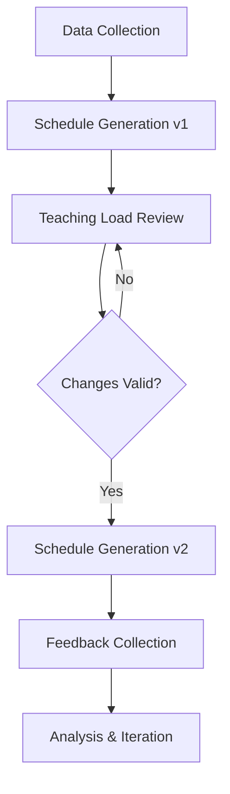

# Comprehensive Test System Guide

> **Created:** 2025-10-27  
> **Purpose:** Complete testing infrastructure for SmartSchedule pre-semester flow

## 🎯 Overview

This test system provides comprehensive coverage for SmartSchedule's **pre-semester scheduling workflow** with:

- ✅ Schema refinements (schedule_versions, teaching_load_change_requests, scheduling_rules)
- ✅ Realistic mock data (33 users, 25 students, 5 courses, 10 sections)
- ✅ Unit, integration, and E2E tests
- ✅ Charts.js dashboard testing
- ✅ Yjs real-time collaboration testing
- ✅ jsondiffpatch version control testing
- ✅ Performance optimization validation

---

## 📊 Test Data Summary

### Users (33 total)
- **25 Students** (5 per level, levels 1-5)
- **3 Faculty** (Dr. Ahmad, Dr. Fatima, Dr. Khalid)
- **2 Scheduling Committee** members
- **2 Teaching Load Committee** members
- **1 Registrar**

### Courses (5 total)
- **4 Required Courses** (SWE101, SWE102, SWE201, SWE301)
- **1 Elective Course** (SWE401 - NOT in generated schedules)

### Sections (10 total)
- **8 Lecture Sections** (2 per required course)
- **2 Lab Sections** (for courses with labs)

### Additional Data
- **~75 Student Preferences** (3-5 preferences per student)
- **3 Faculty Availability** submissions
- **12 Scheduling Rules** (6 hard constraints, 4 soft constraints, 2 preferences)
- **2 Irregular Students** with missing courses

---

## 🗂️ Directory Structure

```
tests/
├── fixtures/                       # Mock data (COMPLETED ✅)
│   ├── users.fixture.ts           # 33 users across all roles
│   ├── courses.fixture.ts         # 5 courses (4 required, 1 elective)
│   ├── sections.fixture.ts        # 10 sections (8 lectures, 2 labs)
│   ├── preferences.fixture.ts     # Student elective preferences
│   ├── availability.fixture.ts    # Faculty availability submissions
│   ├── rules.fixture.ts           # Scheduling rules (hard/soft/preference)
│   ├── schedules.fixture.ts       # Generated schedules (v1 & v2)
│   └── index.ts                   # Central export + loader utilities
│
├── unit/                          # Unit tests (TODO)
│   ├── validators/
│   ├── generators/
│   ├── utils/
│   └── charts/
│
├── integration/                   # Integration tests (TODO)
│   ├── auth/
│   ├── student/
│   ├── faculty/
│   ├── committee/
│   ├── registrar/
│   └── collaboration/
│
├── e2e/                          # End-to-end tests (TODO)
│   ├── pre-semester-flow.test.ts
│   ├── student-journey.test.ts
│   ├── committee-workflow.test.ts
│   └── version-control-flow.test.ts
│
├── performance/                  # Performance tests (TODO)
│   ├── schedule-generation.perf.ts
│   ├── dashboard-loading.perf.ts
│   ├── query-optimization.perf.ts
│   └── yjs-sync.perf.ts
│
├── utils/                        # Test utilities
│   ├── test-helpers.ts
│   ├── supabase-mock.ts
│   └── yjs-test-utils.ts
│
└── COMPREHENSIVE-TEST-GUIDE.md   # This file
```

---

## 🔧 Schema Refinements

### New Tables

#### 1. `schedule_versions`
Tracks all schedule generations with version control.

**Key Columns:**
- `version` - Auto-incrementing version number per term
- `generation_type` - INITIAL | TEACHING_LOAD_EDIT | MANUAL_ADJUSTMENT | REGENERATION
- `statistics` - Aggregate stats (JSONB)
- `changes_from_previous` - jsondiffpatch delta (JSONB)

**Purpose:** Enable version comparison, rollback, and audit trail.

#### 2. `teaching_load_change_requests`
Tracks change requests from teaching load committee with validation.

**Key Columns:**
- `request_type` - REASSIGN_INSTRUCTOR | CHANGE_TIME_SLOT | ADJUST_CAPACITY | OTHER
- `validation_status` - PENDING | VALID | INVALID | APPROVED | REJECTED
- `affects_irregular_students` - Boolean flag
- `irregular_students_affected` - Array of student IDs

**Purpose:** Validate changes don't violate irregular student requirements.

#### 3. `scheduling_rules`
Committee-defined rules with Yjs collaboration support.

**Key Columns:**
- `rule_type` - HARD_CONSTRAINT | SOFT_CONSTRAINT | PREFERENCE | CONFIGURATION
- `priority` - Integer (higher = more important)
- `rule_data` - Flexible JSON structure
- `yjs_document_id` - For real-time collaboration

**Purpose:** Store scheduling constraints for generator, support Yjs real-time editing.

#### 4. `scheduling_rules_collaboration`
Tracks collaboration history on rules.

**Key Columns:**
- `action` - EDIT | COMMENT | VIEW | APPROVE | REJECT
- `session_id` - Yjs WebSocket session
- `changes` - CRDT changes

**Purpose:** Audit trail for real-time collaboration.

### Enhanced Tables

#### Enhanced `capacity_thresholds`
- Added: `max_capacity_override`, `current_utilization`, `threshold_reached`, `last_checked_at`
- Purpose: Better capacity management for registrar

#### Enhanced `feedback`
- Added: `feedback_category`, `severity`, `schedule_version`, `reviewed_by`, `resolution`, `is_resolved`
- Purpose: Better categorization and tracking

#### Enhanced `schedules`
- Added: `schedule_version_id`, `status`, `published_by`, `published_at`
- Purpose: Link to version control system

---

## 📦 Using Test Fixtures

### Quick Start

```typescript
import { TEST_FIXTURES, FIXTURE_SUMMARY } from '@/tests/fixtures';

// Access users
const allStudents = TEST_FIXTURES.users.students;
const firstStudent = TEST_FIXTURES.users.quickRef.students.firstStudent;
const drAhmad = TEST_FIXTURES.users.quickRef.faculty.drAhmad;

// Access courses
const allCourses = TEST_FIXTURES.courses.all;
const requiredCourses = TEST_FIXTURES.courses.required;

// Access sections
const swe101Sections = TEST_FIXTURES.sections.helpers.getByCourse('SWE101');

// Access preferences
const studentPrefs = TEST_FIXTURES.preferences.helpers.getByStudent(firstStudent.id);

// Access schedules
const v1Schedules = TEST_FIXTURES.schedules.v1;
const v2Schedules = TEST_FIXTURES.schedules.v2;
const comparison = TEST_FIXTURES.schedules.helpers.getVersionComparison();

// View summary
console.log(FIXTURE_SUMMARY);
```

### Loading Fixtures to Database

```typescript
import { loadFixturesToDatabase, clearFixturesFromDatabase } from '@/tests/fixtures';
import { createServerClient } from '@/lib/supabase/server';

// In test setup
beforeAll(async () => {
  const supabase = await createServerClient();
  await clearFixturesFromDatabase(supabase);
  const results = await loadFixturesToDatabase(supabase);
  console.log('Loaded fixtures:', results);
});

// In test teardown
afterAll(async () => {
  const supabase = await createServerClient();
  await clearFixturesFromDatabase(supabase);
});
```

---

## 🔄 Pre-Semester Flow (System Under Test)



### Phase 1: Data Collection
- Students submit elective preferences (ranked 1-10)
- Faculty submit availability (grid + notes)
- Committee enters scheduling rules (with Yjs collaboration)
- Registrar enters irregular student requirements

### Phase 2: Schedule Generation v1
- **Input:** Preferences, availability, rules, irregular requirements
- **Algorithm:** Generate REQUIRED COURSES ONLY (NO electives)
- **Output:** Draft schedules (JSONB) for all students
- **Status:** DRAFT

### Phase 3: Teaching Load Committee Review
- Review faculty workload distribution
- Submit change requests (e.g., reassign instructor)
- **Validation:** Check if changes violate irregular student requirements
  - If violation → REJECT changes
  - If valid → APPROVE changes

### Phase 4: Schedule Generation v2
- Apply approved changes
- Regenerate schedules
- **jsondiffpatch:** Calculate diff (v1 → v2)
- **Status:** PUBLISHED_DRAFT

### Phase 5: Feedback Collection
- Students view schedules + submit feedback
- Faculty view teaching schedules + submit feedback
- Committee reviews feedback dashboard (Charts.js)

---

## 🧪 Test Categories

### 1. Unit Tests
Test individual functions in isolation.

**Examples:**
- Preference validator (min 3 preferences, package requirements)
- Conflict detector (time overlaps, room double-booking)
- Schedule generator helpers
- Charts.js data formatters
- jsondiffpatch delta generation

### 2. Integration Tests
Test API endpoints and data flows.

**Examples:**
- Student preference submission API
- Faculty availability submission API
- Schedule generation API
- Teaching load change request API
- Version control operations
- Yjs real-time sync

### 3. E2E Tests
Test complete user journeys.

**Examples:**
- Complete pre-semester flow (collection → v1 → review → v2 → feedback)
- Student journey (login → submit prefs → view schedule → feedback)
- Committee workflow (setup → rules → generate → publish)
- Version control flow (v1 → changes → v2 → diff → rollback)

### 4. Performance Tests
Validate performance optimizations.

**Examples:**
- Schedule generation time (<5 seconds for 25 students)
- Dashboard loading time (<2 seconds)
- Query optimization (RLS policies, indexes)
- Yjs sync latency (<200ms)

---

## 📊 Testing Main Deliverables

### 1. Charts.js Dashboards

**Dashboards to Test:**

#### Scheduling Committee Dashboard
- Phase tracking (Setup, Collection, Generation, Review, Published)
- Completion rates (students submitted, faculty submitted)
- Real-time metrics updates

#### Teaching Load Dashboard
- Faculty workload distribution (histogram)
- Load balance analysis
- Change requests visualization

#### Analytics Dashboard
- Satisfaction rate (bar chart)
- Room utilization heatmap
- Feedback distribution (pie chart)

**Test Requirements:**
- Data formatting for Charts.js
- Chart rendering (snapshot tests)
- Interactive updates (filtering, sorting)
- Export functionality (CSV, PNG)

### 2. Yjs Real-Time Collaboration

**Features to Test:**
- Concurrent editing of scheduling rules
- Conflict-free merging (CRDT)
- User presence indicators
- Change history tracking
- Auto-save functionality
- Session management

**Test Scenarios:**
- 2+ users editing same rule simultaneously
- Network interruption recovery
- Merge conflicts resolution
- Large document performance

### 3. jsondiffpatch Version Control

**Features to Test:**
- Delta generation (v1 → v2)
- Visual diff display
- Rollback functionality
- Audit trail
- Change summary statistics

**Test Scenarios:**
- Instructor reassignment diff
- Time slot change diff
- Room change diff
- Complex multi-section changes
- Rollback to previous version

### 4. Performance Optimizations

**Validations:**
- RLS policies: `auth.uid()` wrapped in subquery ✅
- Database indexes on frequently queried columns ✅
- React.cache() for all data fetching ✅
- Parallel fetching with Promise.all() ✅
- Query execution time (<100ms p95)
- Dashboard loading time (<2 seconds)
- Schedule generation time (<5 seconds)

---

## 🚀 Running Tests

### Run All Tests
```bash
npm test
```

### Run by Category
```bash
npm test tests/unit
npm test tests/integration
npm test tests/e2e
npm test tests/performance
```

### Run Specific Test
```bash
npm test tests/integration/committee/schedule-generation.test.ts
```

### With Coverage
```bash
npm test -- --coverage
```

### Watch Mode
```bash
npm test -- --watch
```

---

## ✅ Success Criteria

### Test Coverage
- Unit tests: >80% coverage
- Integration tests: All API endpoints covered
- E2E tests: Complete user journeys covered

### Performance
- Schedule generation: <5 seconds (25 students)
- Dashboard load: <2 seconds
- Yjs sync: <200ms latency
- All queries: <100ms (p95)

### Deliverables
- ✅ Charts.js dashboards functional with tests
- ✅ Yjs collaboration working with real-time sync tests
- ✅ jsondiffpatch version control complete with tests
- ✅ Performance optimizations validated with benchmarks

---

## 📝 Test Writing Guidelines

### 1. Use Fixtures
```typescript
import { TEST_FIXTURES } from '@/tests/fixtures';

// ✅ GOOD
const student = TEST_FIXTURES.users.students[0];
const schedule = TEST_FIXTURES.schedules.helpers.getByStudent(student.id);

// ❌ BAD: Hardcoded data
const student = { id: 'abc123', name: 'Test' };
```

### 2. Clean Up After Tests
```typescript
beforeEach(async () => {
  await clearFixturesFromDatabase(supabase);
  await loadFixturesToDatabase(supabase);
});

afterEach(async () => {
  await clearFixturesFromDatabase(supabase);
});
```

### 3. Test Isolation
- Each test should be independent
- Don't rely on test execution order
- Clean up any state changes

### 4. Descriptive Names
```typescript
// ✅ GOOD
it('should reject teaching load change when it violates irregular student requirements', async () => {
  // ...
});

// ❌ BAD
it('test 1', async () => {
  // ...
});
```

### 5. Arrange-Act-Assert
```typescript
it('should generate schedule with correct sections', async () => {
  // Arrange
  const student = TEST_FIXTURES.users.students[0];
  const level = 1;
  
  // Act
  const schedule = generateScheduleForStudent(student.id, level);
  
  // Assert
  expect(schedule.data.sections).toHaveLength(2); // SWE101, SWE102
  expect(schedule.data.sections[0].course_type).toBe('REQUIRED');
});
```

---

## 🔍 Debugging Tests

### View Fixture Data
```typescript
import { FIXTURE_SUMMARY } from '@/tests/fixtures';
console.log(FIXTURE_SUMMARY);
```

### Verbose Output
```bash
npm test -- --reporter=verbose
```

### Debug Single Test
```bash
npm test -- -t "should generate schedule"
```

### VS Code Debugging
Add breakpoints and use the Vitest extension.

---

## 📚 Next Steps

1. **Phase 3: Unit Tests** (3 days)
   - Implement validator tests
   - Implement generator tests
   - Implement utility tests

2. **Phase 4: Integration Tests** (5 days)
   - Student APIs
   - Faculty APIs
   - Committee APIs
   - Collaboration tests

3. **Phase 5: E2E Tests** (3 days)
   - Pre-semester flow
   - User journeys
   - Version control flow

4. **Phase 6: Performance Tests** (2 days)
   - Benchmarks
   - Load tests
   - Query optimization validation

---

## 📖 Related Documentation

- [Schema Migration](/supabase/migrations/20251027_test_system_refinements.sql)
- [Test Schema Types](/src/types/test-schema.ts)
- [Fixture Index](/tests/fixtures/index.ts)
- [System PRD](/docs/PRD.md)
- [Timetabling System Guide](/docs/TIMETABLING-SYSTEM-GUIDE.md)

---

**Last Updated:** 2025-10-27  
**Status:** Mock data fixtures complete ✅ | Tests in progress 🚧

